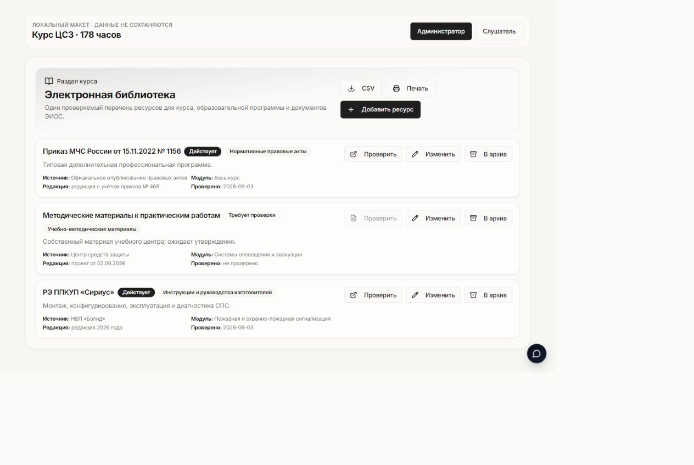
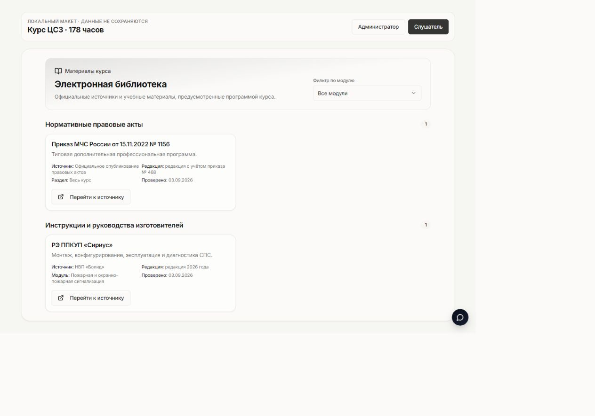

# Электронная библиотека курса ЦСЗ, 178 часов

Дата снимка: 2026-09-03

Локальная ветка: `codex/csz-electronic-library-178h`

Базовый `HEAD`: `ed5798f5ccb2e438e4c939340c575ecf21ea1478`

## Текущий статус

**NO-GO для импорта, публикации курса и production.** Это локальный кандидат архитектуры и интерфейса. Миграция не применялась, новый курс не создавался, ресурсы в базу и Storage не загружались, production не изменялся.

> Граница версий: находящийся в этом каталоге 28-строчный `candidate-manifest.json`
> является ранним аудитом расширенной библиотеки и остаётся целиком на `HOLD`.
> Importer v2 его не читает. Для третьей подачи importer v2 принимает только
> финальный пакет `csz_refiling_20260903`: learner-safe HTML, отдельный закрытый
> JSON и ровно 8 официальных HTTPS-ресурсов. Инструкции изготовителей, видео и
> другие строки раннего аудита автоматически в новый курс не импортируются.

В [candidate-manifest.json](./candidate-manifest.json) зафиксированы:

- `approval_status: not_approved`;
- `import_ready: false`;
- `overall_decision: NO_GO`;
- обязательное состояние нового курса: `unpublished`;
- идентификатор нового курса пока отсутствует.

Кандидат теперь содержит обязательный course-local feature flag
`landing_content.electronic_library.enabled: true`. Без точного boolean `true`
валидатор импорта, интерфейс и серверная привязка ресурса работают fail-closed.
У всех существующих курсов, включая опубликованный курс ЦСЗ и курсы ГОРЭЛТЕХ,
библиотека по умолчанию выключена и их текущий интерфейс не меняется.

## Архитектура без второй дублирующей библиотеки

Используется существующая модель:

- `library_documents` — каноническая карточка ресурса организации;
- `course_documents` — связь ресурса с курсом и, при необходимости, с модулем;
- существующий bucket `library-files`, который миграция переводит/удерживает в приватном режиме, — внутренние файлы; публичные URL не сохраняются, доступ предполагается через короткоживущие signed URL;
- внешние источники сохраняются как HTTPS-ссылки.

Подготовленная, но **не применённая** миграция `supabase/migrations/20260903100000_csz_electronic_library_schema.sql` добавляет:

- к `library_documents`: источник, внешнюю ссылку или приватный путь, MIME-тип, исходное имя файла, редакцию/дату, дату проверки, основание использования, статус `active / needs_review / archive` и аудит архивирования;
- к `course_documents`: `library_document_id`, `module_id`, категорию, порядок, видимость слушателю и разрешение на скачивание;
- категории `legal_acts`, `educational_materials`, `manufacturer_guides`, `additional_resources`;
- tenant/module guards, permission-aware RLS и проверку пути `library/{organization_id}/{uuid}-{safe_filename}`;
- серверную проверку course-local feature flag: ресурс нельзя привязать к курсу,
  где `landing_content.electronic_library.enabled` не равен boolean `true`, а
  преподаватель или слушатель не может обойти скрытый интерфейс прямым REST-запросом;
- узкий доступ зачисленного слушателя к оболочке и названиям модулей нового
  неопубликованного курса только при собственном актуальном enrollment и
  совпадении tenant; уроки и тесты чернового курса эта миграция не открывает;
- архивирование карточек вместо клиентского `DELETE`; удалить из Storage можно только незакреплённый файл при компенсации неудачного создания карточки.

Миграция требует уже существующий `library-files` и намеренно не создаёт новый bucket.

## Как сохраняется старый курс

Существующий курс `e3737d51-c092-4564-b2a6-4c9b86245ff4` внесён в `do_not_modify_course_ids` и не должен использоваться как цель импорта.

Новый 178-часовой курс должен получить отдельный ID и оставаться неопубликованным до приёмки. Новые поля nullable либо имеют обратно совместимые значения по умолчанию, а старые строки `course_documents` без `library_document_id` остаются допустимыми.

На текущем локальном этапе старый курс не менялся, потому что ни миграция, ни импорт данных не запускались. Это **не является runtime-доказательством** сохранности после миграции: перед staging и после него нужно отдельно сравнить снимок старого курса, его модулей, уроков, тестов и документов. Дополнительно нужно проверить регрессию существующих файлов, поскольку миграция переводит `library-files` в приватный режим и меняет RLS.

## Что присутствует в локальном рабочем дереве

- API чтения, создания, обновления, архивирования и получения signed URL: `src/api/courseLibrary.ts`;
- fail-closed проверка источника до первого Storage/DB-запроса: внешний ресурс принимает только абсолютный HTTPS URL без credentials, внутренний — только настоящий `File`, смешивание двух источников запрещено;
- менеджер библиотеки организации: `src/components/course-library/CourseLibraryManager.tsx`;
- диалог карточки ресурса: `src/components/course-library/CourseLibraryResourceDialog.tsx`;
- интерфейс слушателя: `src/components/course-library/CourseLibraryReader.tsx`;
- подключение менеджера в карточку курса организации;
- подключение библиотеки в `CourseLearning` и боковое меню слушателя;
- локальный mock-harness `/dev/course-library-harness`;
- воспроизводимый D:-only PostgreSQL 17 harness
  `scripts/run-course-library-local-postgres.ps1` с отдельными фикстурами
  `supabase/tests/fixtures/course_library_local_base.sql` и
  `supabase/tests/course_library_local_rls_contract.sql`; он создаёт новый
  одноразовый кластер только на `127.0.0.1`, сохраняет хеши и PASS-маркеры и
  после подтверждённого запуска останавливает сервер в `finally`;
- генератор кандидатного манифеста: `scripts/build-csz-course-library-candidate.mjs`;
- транзакционный dry-run миграции для отдельного staging-клона: `supabase/tests/course_library_migration_dry_run.sql`;
- fail-closed PowerShell-запуск dry-run: `scripts/run-course-library-migration-dry-run.ps1`;
- zero-I/O планировщик импорта утверждённого манифеста:
  `src/lib/courseLibraryImportDryRun.ts`; он не содержит apply/commit-функции,
  жёстко фиксирует tenant ЦСЗ, 178 часов, denylist старого курса и требует
  отдельно переданный `approvedTargetCourseId`, который не читается из
  манифеста. Без него результат только `BLOCKED`; при совпадении возможен
  статус `MANIFEST_VALID` и `DRY_RUN_ONLY`-план, но не `READY` к импорту;
- тестовые файлы для API-контракта, моделей, манифеста, reader, sidebar и security-контракта миграции.

Эти пункты означают наличие локального кода, а не подтверждённую готовность staging или production.

Zero-I/O проверка не может подтвердить существование курса в базе, его tenant,
178 часов, unpublished-состояние, feature flag, принадлежность module ID курсу
или отсутствие уже импортированных ресурсов. Эти факты перечисляются в
`unverifiedDatabaseFacts` и должны быть повторно проверены внутри одной
транзакции на отдельном staging. До такой проверки импорт и production
остаются **NO-GO**.

## Локальные скриншоты

Скриншоты получены из mock-harness. Они показывают предполагаемую компоновку, но **не подтверждают** работу с реальной staging-базой, RLS, Storage или ролями.

### Организация

### Слушатель

## Проверки на момент отчёта

| Проверка | Статус | Честное ограничение |
|---|---|---|
| Локальный PostgreSQL dry-run миграции и RLS | Предыдущее доказательство библиотеки: PASS на PostgreSQL 17.11 (`127.0.0.1:55439`) воспроизводимым runner с обязательным `ROLLBACK` и четырьмя RLS-сценариями | Этот PostgreSQL-прогон не повторялся после переноса на актуальный `main` и автономизации v2; он не заменяет новый linked dry-run обеих release-миграций |
| Целевые автоматические тесты | На integration candidate: 12 файлов, 105/105, exit 0; подготовленные HTML и закрытые ключи переданы через точные `CSZ_COURSE_HTML`/`CSZ_COURSE_KEYS` | Это unit/component/API/security-contract тесты, не DB-backed E2E |
| Полный Vitest-прогон | На integration candidate не выполнялся | Целевой зелёный прогон нельзя выдавать за полный регрессионный прогон |
| TypeScript | `tsc --noEmit`, exit 0 на Node.js 20.20.2 | Типы не заменяют runtime-проверку ролей и Storage |
| ESLint изменённых TypeScript/TSX-файлов | На integration candidate не выполнялся | Нужен отдельно, если будет включён в release policy |
| Production build | Vite: 6 460 модулей, exit 0 на Node.js 20.20.2 | Есть неблокирующие предупреждения Browserslist, PDF.js `eval` и mixed dynamic/static import |
| Локальный mock-harness | Скриншоты получены | Это mock-данные, не DB-backed E2E |
| Применение миграции на staging | Не выполнялось | Нужен отдельный контролируемый прогон |
| RLS-проверка локального стенда | Администратор создаёт, читает, изменяет и архивирует ресурс без физического удаления; преподаватель и зачисленный слушатель видят активный материал, преподаватель не может изменять данные; архив, незачисленный и cross-tenant доступ скрыты; неверные tenant/module связи отклонены | Не заменяет Supabase JWT/RLS/Storage E2E на отдельном staging |
| Импорт 178-часового курса и ресурсов | Не выполнялся | Манифест имеет `NO_GO` |
| Production | Не затрагивался | Нет основания заявлять production-ready |

## Верификация ресурсов

[resource-verification-2026-09-03.json](./resource-verification-2026-09-03.json) содержит 28 кандидатных ссылок: 8 нормативных источников и 20 материалов производителей. Проверка включала HTTP HEAD/GET и read-only просмотр официальных страниц и PDF; исходные материалы в рабочую папку не сохранялись.

Результат доступности:

- HTTP 200 — 21;
- HTTP 404 — 1;
- сетевой timeout — 5;
- ошибка TLS — 1.

После повторной проверки две исходные ссылки исправлены непосредственно в
пакете: приказ МЧС № 1156 теперь ведёт на официальную страницу МЧС, а каталог
сводов правил — на актуальный официальный путь. Ещё пять рабочих замен
первичными источниками подтверждены в реестре:

- приказ МЧС № 468 — официальный реестр и PDF Минюста;
- приказ Минобрнауки № 266 — официальный реестр и PDF Минюста;
- постановление Правительства № 1479 — официальный PDF МЧС;
- официальный PDF DoorHan для сдвижных противопожарных ворот;
- официальные страница изделия и PDF ЗАО «Пожтехника» для ОП-4(з)-АВСЕ.

Ссылка `https://mchs.gov.ru/dokumenty/602` отклонена как ложная замена: она ведёт на постановление Правительства РФ № 390 от 25.04.2012, а не на № 1479 от 16.09.2020. Для № 1479 зафиксирован точный открывающийся официальный PDF МЧС в редакции от 03.02.2025 со сроком действия до 31.12.2026.

Остаются пять критических source/playback-разрывов: две неоткрытые официальные записи (04, 05), видео RUTUBE с подтверждённым происхождением, но без успешного playback E2E (22), HTTPS-ресурс с неверным сертификатом (26) и видео без подтверждённого владельца канала (28). При этом до явного утверждения итогового состава у всех 28 внешних строк сохраняется `import_action=HOLD`.

HTTP 200 не означает правовое разрешение на копирование или готовность к импорту. Для части материалов допустим только внешний link-only режим. Два собственных материала — «Методические материалы к практическим работам» и «Фонд оценочных средств» — остаются `needs_review / HOLD_UNTIL_APPROVED`. Для 11 модулей пока нет одновременно утверждённого отдельного материала и ID модуля нового курса.

## NO-GO блокеры

1. Новый 178-часовой курс ещё не существует: нет `target_course.id` и ID его модулей.
2. Исходный манифест и внутренние файлы не утверждены.
3. Пять критических source/playback-кандидатов требуют устранения разрывов; пять подтверждённых замен ещё не утверждены, поэтому все 28 внешних строк остаются `import_action=HOLD`.
4. Для материалов производителей и видео не принято решение `link-only` либо не получено отдельное подтверждение прав.
5. Собственные учебные материалы не сопоставлены с модулями нового курса.
6. Миграция прошла локальный PostgreSQL parser/catalog/RLS dry-run, но не проверена на реальном Supabase staging и не применялась на staging.
7. Не выполнен DB-backed E2E tenant isolation, permission/RLS, private Storage и signed URL.
8. Не доказано отсутствие регрессии существующих `library_documents`, `course_documents` и потребителей `library-files` после ужесточения доступа.
9. Подготовлен только zero-I/O import plan; транзакционного DB-executor намеренно нет до утверждения манифеста и staging-проверок.

В текущем checkout нет отдельного staging Supabase: `.env`, `supabase/config.toml` и Lovable указывают на единственный remote ref. Для локальной проверки найден переносимый PostgreSQL 17.11 и выполнен воспроизводимый изолированный прогон на `127.0.0.1:55443`; сервер после проверки остановлен, а машинное доказательство сохранено в `D:\CodexTmp\course-library-local-acceptance\20260903-082844-0e4d4688\result.json`. URL/учётные данные отдельного Supabase staging и тестовые JWT отсутствуют, поэтому Supabase DB/RLS/Storage E2E намеренно не запускался против текущего `.env` и production не затрагивался.

## Безопасный порядок staging

1. Зафиксировать commit-кандидат и приложить результаты целевых тестов, полного TypeScript/build-прогона и статической проверки миграции.
2. Снять до-миграционный снимок старого курса `e3737d51-c092-4564-b2a6-4c9b86245ff4`: курс, модули, уроки, тесты, документы и доступ к файлам.
3. Администратор отдельного staging-клона должен вне репозитория и вне запуска dry-run подготовить `public.sintagma_staging_guard` с одноразовым токеном. Скрипты проекта намеренно не создают и не заполняют этот sentinel.
4. Задать явные allowlist staging project ref и database host, затем запускать только `scripts/run-course-library-migration-dry-run.ps1`. Обёртка до первого SQL отвергает production ref `atxwvjxbqjgkbjlhsdch`, URL вне allowlist и URL, из которого нельзя однозначно определить Supabase project ref; после этого отдельно проверяет sentinel.
5. Обёртка запускает `supabase/tests/course_library_migration_dry_run.sql`: он снимает контрольные отпечатки ключевых полей старого курса, legacy-библиотеки и полных строк Storage, применяет миграцию внутри транзакции, проверяет точные владельцы/типы/default колонок, определения и владельцев constraints/triggers/indexes, RLS/политики и выполняет `ROLLBACK` до сообщения `PASS`.
6. После успешного dry-run сделать резервную копию staging-БД, применить миграцию обычным механизмом **только на staging** и сохранить журнал.
7. Выполнить регрессионный тест старых курсов и legacy-библиотеки; сравнить старый курс с исходным снимком.
8. Создать отдельный новый курс на 178 часов в состоянии `unpublished`, получить ID курса и модулей; старый курс не редактировать.
9. Повторно верифицировать источники, утвердить собственные материалы и права; только после этого перевести разрешённые карточки из `needs_review` в `active`.
10. Импортировать сначала небольшой утверждённый набор, сопоставить его с модулями и проверить интерфейсы организации и слушателя.
11. Провести DB-backed E2E: администратор/разрешённый сотрудник управляет ресурсами, слушатель видит только `active + visible`, другая организация не получает доступ, archive скрывается, signed URL ограничен по времени, незакреплённый файл очищается.
12. После приёмки staging заново сформировать манифест, получить явное `GO` и отдельное разрешение на production. До этого новый курс остаётся неопубликованным.

## Критерий готовности

Переход от `NO_GO` к `GO` возможен только когда одновременно закрыты блокеры манифеста, подтверждены test/build, migration/RLS/Storage E2E на staging, доказана сохранность старого курса и получено явное разрешение на публикацию.
